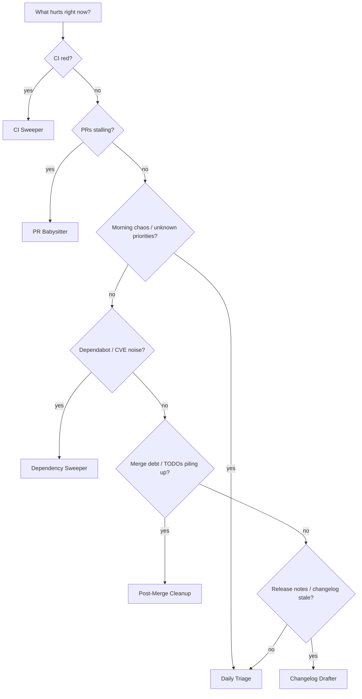

# Which Pattern When?

Pick one primary loop per concern. Overlapping loops need coordination — see [multi-loop.md](./multi-loop.md).



## Quick reference

| Symptom | Pattern | Start with |
|---------|---------|------------|
| CI failing on main or PRs | [CI Sweeper](../patterns/ci-sweeper.md) | L2, 15m cadence, max 3 attempts |
| PRs waiting on review/CI/rebase | [PR Babysitter](../patterns/pr-babysitter.md) | L1 watch → L2 assisted |
| "What should I work on?" every morning | [Daily Triage](../patterns/daily-triage.md) | **L1 report-only week one** |
| Outdated packages / CVE alerts | [Dependency Sweeper](../patterns/dependency-sweeper.md) | L2 patch-only, denylist majors |
| TODOs and cleanup after merges | [Post-Merge Cleanup](../patterns/post-merge-cleanup.md) | L1 off-peak, small fixes only |
| Stale or missing release notes | [Changelog Drafter](../patterns/changelog-drafter.md) | **L1** (draft only first), very low risk |

## Overlap rules

| Combination | Rule |
|-------------|------|
| CI Sweeper + PR Babysitter | CI Sweeper owns failing checks; PR Babysitter does not re-fix the same branch in the same hour |
| Daily Triage + anything | Daily Triage reports; action loops execute. Triage does not auto-fix in L1 |
| Dependency Sweeper + CI Sweeper | Pause Dependency Sweeper while CI is red on main |
| Post-Merge + PR Babysitter | Post-Merge runs off-peak only |
| Changelog Drafter + anything | Changelog Drafter is read-mostly and safe to run alongside others; it should not auto-publish |

## First loop recommendation

If unsure, start with **Daily Triage at L1**. It teaches state discipline without auto-merge risk.

```bash
npx @cobusgreyling/loop-init . --pattern daily-triage --tool grok
npx @cobusgreyling/loop-audit . --suggest
```